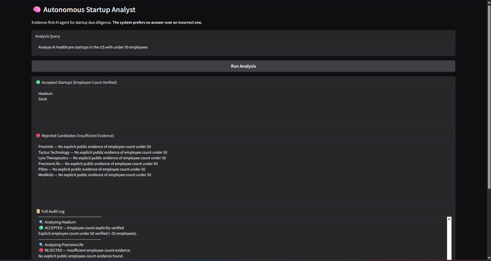
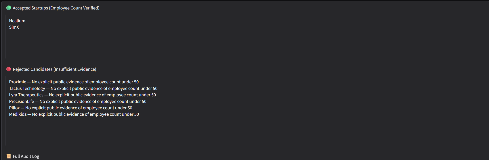
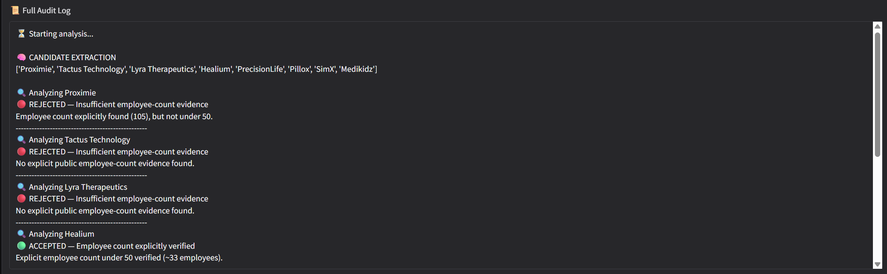
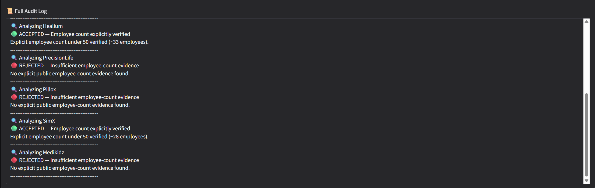

# 🧠 Startup Due Diligence Agent  
**Evidence-First AI Agent for Startup Analysis**

An autonomous, evidence-driven AI agent that performs **startup due diligence** with a **strict verification pipeline**.

> ⚠️ **Design Principle:**  
> **No evidence → No acceptance**

The system refuses to speculate and only accepts claims that are **explicitly supported by public, numeric evidence**.

---

## 🚀 What This Project Does

Given a user query like:

> *“Analyze AI healthcare startups in the US with under 50 employees”*

The agent:

- ✅ Extracts **real startup candidates** (no media, no generic terms)
- 🔍 Performs **focused per-company research**
- 📊 Detects **explicit numeric employee counts**
- 🟢 **Accepts** startups *only if* employee count **< 50 is verified**
- 🔴 **Rejects** everything else with **clear reasons**
- 📜 Produces a **full audit log** explaining every decision
- 🖥️ Presents results through a **Gradio web UI**

This mirrors **investor-grade due diligence**, not blog-style summaries.

---

## 🧩 System Architecture

The system follows a **strict, multi-agent verification pipeline** where every decision is evidence-gated.


---

## 🧠 Core Design Philosophy

- ❌ No guessing  
- ❌ No extrapolation  
- ❌ No vague “early-stage” assumptions  
- ✅ Explicit **numeric evidence only**  
- ✅ Transparent rejection reasons  
- ✅ Full audit trail  

This makes the system **trustworthy, auditable, and defensible**.

---

## 📁 Project Structure

```
startup-due-diligence-agent/
│
├── main.py                     # CLI pipeline runner
├── requirements.txt
├── README.md
│
├── agents/
│   ├── candidates.py           # Multi-pass startup extraction
│   ├── researcher.py           # Per-company evidence retrieval
│   ├── evidence.py             # Hard validation + employee count detection
│   ├── planner.py
│   ├── finance.py
│   └── risk.py
│
├── tools/
│   └── web_search.py          # Multi-query web search
│
├── memory/
│   └── vector_store.py        # FAISS-based evidence retrieval
│
├── config/
│   └── settings.py
│
└── ui/
    └── app.py                 # Gradio web interface
```

## 🔍 Employee Count Verification (Key Feature)

A startup is **ACCEPTED only if**:

- A **numeric employee count** is found  
- The count is **explicitly stated** in public sources  
- The number is **strictly under 50**

### Examples

| Evidence Found | Result |
|---------------|--------|
| “~33 employees” | ✅ Accepted |
| “28 employees” | ✅ Accepted |
| “50 employees” | ❌ Rejected |
| “Early-stage startup” | ❌ Rejected |
| “Small team” | ❌ Rejected |
| No number | ❌ Rejected |

This logic is **enforced in `agents/evidence.py`** and **cannot be bypassed**.

---
## 🖥️ Web UI (Gradio)

The UI displays:

- 🟢 **Accepted Startups** (employee count verified)
- 🔴 **Rejected Candidates** (with reasons)
- 📜 **Full Audit Log** (every decision explained)

### ▶ Run the UI

```bash
python ui/app.py
```
## Visual Overview

### Analysis Interface & Results

| Analysis Interface | Accepted Startups | Rejected Candidates |
|---|---|---|
| [](https://github.com/analyticsplatform/screenshots/blob/main/analysis-interface.png) | [](https://github.com/analyticsplatform/screenshots/blob/main/accepted-startups.png) | [](https://github.com/analyticsplatform/screenshots/blob/main/rejected-candidates.png) |

### Audit Trail & System Logic

| Full Audit Log (Part 1) | Full Audit Log (Part 2) |
|---|---|
| [](https://github.com/analyticsplatform/screenshots/blob/main/full-audit-log1.png) | [](https://github.com/analyticsplatform/screenshots/blob/main/full-audit-log2.png) |


## ⚙️ Installation & Setup

### 1️⃣ Clone the repository
```bash
git clone https://github.com/UmarJaveedAltaf/Startup-Due-Diligence-Agent.git
cd Startup-Due-Diligence-Agent
```

### 2️⃣ Install dependencies
```bash
pip install -r requirements.txt
```

### 3️⃣ Run the application
```bash
python ui/app.py
```

> ⚠️ **Note:**  
> Requires a local **Ollama** setup with **Llama 3**.

---

## ⚠️ Disclaimer

This project is for **educational and research purposes only**.  
It does **not** constitute financial, legal, or investment advice.

